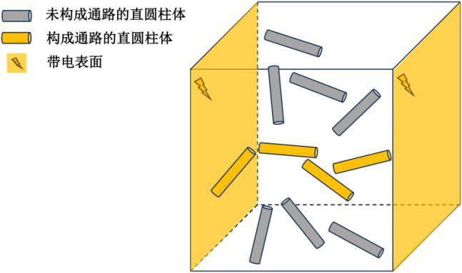
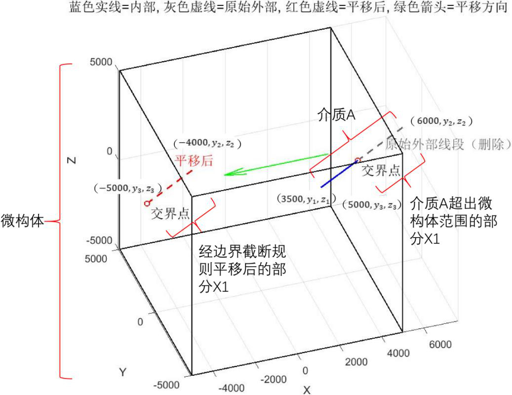

# A题 微构体中填充导电介质的仿真优化

> 本文档由 PDF 自动转换生成。

2026 年第七届“华数杯”大学生数学建模竞赛

A题微构体中填充导电介质的仿真优化

一种导电体系由多种填充介质组成，研究其导电性能与填充介质之间的关系，

对新能源、新材料及半导体领域的研究具有重要意义。为便于研究此种导电体系

的导通问题，研究人员将研究对象理想化成一个边长10000nm（nm：纳米）正方

体的微型结构，以下简称为“微构体”，如图1 所示。研究微构体的导通情况即

可反映该导电体系的导电性能。微构体内部默认充满绝缘溶剂和若干导电介质。

在微构体中，所有导电介质可以悬浮于微构体内部的任意位置，任意方向。不考

虑导电介质的重力作用，即导电介质所受的合力为0。

图1 填充介质A 的微构体情况示意图（微构体和介质A 的比例已进行适当缩放）。图中所

有黄色的介质A 在两个带电表面之间构成通路（两个相邻黄色介质A 导通，并且有黄色介质

A 和两个带电表面也导通），此时整个微构体视为导通。

现有的导电介质存在两种形状。第一种导电介质为直圆柱体，直圆柱体高为

5000nm，底面半径为30nm，以下简称介质A；第二种导电介质为半径200nm 的正

球体，以下简称介质B。所有导电介质均位于微构体范围内，不允许任何部分超

出微构体边界。在计算机仿真中，导电介质超出微构体边界的部分默认统一采用

边界截断规则（具体规则见相关说明）进行处理。

选择微构体两个相对的面作为带电表面，默认这两个面的所有位置均带电，

剩余四个面则默认不带电且绝缘，也不导电。同时，在计算机仿真中，微构体中

的导电介质位置一旦固定，就不会移动，介质之间不存在碰撞关系，允许介质因

随机生成而产生相互贯穿、重叠等情况。一个导电介质是否能带电取决于该导电

介质与带电表面或者其余已经带电的导电介质之间的最短距离。当最短距离小于

等于1.8nm 时，导电介质和带电表面之间或者两个导电介质之间视为导通；大于

1.8 nm 时，视为不导通。假设导电介质m 开始时不带电，若现在周围存在已经

带电的导电介质n 且m 与n 之间的最短距离小于等于1.8nm，则m 由于极化作用

也全部带电，m 与n 视为导通。若微构体两个相对的带电表面之间存在至少一条

由导电介质构成的完整通路，则判定该微构体导通。

需要额外注意的是，微构体的导通性仅在两个带电表面之间进行判定。在本

研究中，为方便计算，微构体的中心点为坐标轴原点，且长宽高分别平行于XYZ

轴，并选取垂直于X 轴的两个表面为带电表面，即微构体的带电表面仅为正方体

的左面和右面。

请建立数学模型解决以下问题：

问题1：若微构体中的导电介质只有介质A。附件1 给出了三个微构体中所

有介质A 的坐标，试分析三个微构体是否导通，分别给出三个微构体的导通情况。

问题2：若向微构体中仅添加介质A，添加介质A 的体积分数（名词解释见

相关说明）为0.50%，计算在当前条件下微构体的导通概率。若将介质A 的体积

分数依次调整为0.60%、0.70%和1.00%，请分别计算对应的微构体导通概率。

如果体积分数对应的介质A 的数量不是整数，四舍五入即可。

问题3：若微构体中的导电介质只包含介质A。试计算在微构体导通的概率

不低于90%的前提下，介质A 的最低填充量（结果使用体积分数表示，并精确到

百分号下小数点后两位）。

问题4：若在微构体中同时填充介质A 和介质B。介质A 成本为1.05 元/μm3

（μm：微米），介质B 的成本为0.05 元/μm3。试计算在微构体导通的概率不

低于90%的前提下，两种介质的填充量为多少时，使得微构体填充导电介质的总

成本最低。

相关说明

（1）体积分数：导电介质的总体积占微构体总体积的百分比。

（2）边界截断规则：当导电介质的任一部分超出微构体边界时，首先，将

超出部分沿某一越界方向的反方向平移一个微构体边长，使其由相对侧边界重新

进入微构体。若平移后仍在其他方向超出边界，则重复上述操作，直至所有超出

部分均回到微构体范围内。如图2 所示，假设介质A 两端顶点坐标分别为

（3500, y1, z1）和（6000, y2, z2），其部分区域X1 沿X 轴方向超出边界，X1 两

端顶点坐标分别为（5000, y3, z3）和（6000, y2, z2）。将X1 对应的X 坐标减去

微构体在该方向上的边长，平移后的X1 两端顶点坐标分别为（−5000, y3, z3）

和（−4000, y2, z2）。

若平移后的X1 仍在Y 轴或Z 轴方向超出边界，则重复上述操作即可。

图2 边界截断规则图例。经边界截断规则处理之后，介质A 为蓝色实线部分和红色虚线部

分，此时介质A 所有部分均在微构体内部。

附件说明

附件：一共三个分表（组1，组2，组3），每一个分表表示一个微构体中

包含的所有介质A。其中，每一行表示一个介质A，前三列表示一个顶点（顶点

指介质A 的轴与介质A 底面的交点）的三维坐标，后三列表示另外一个顶点的三

维坐标。
