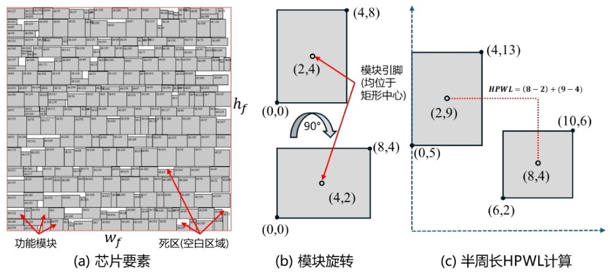
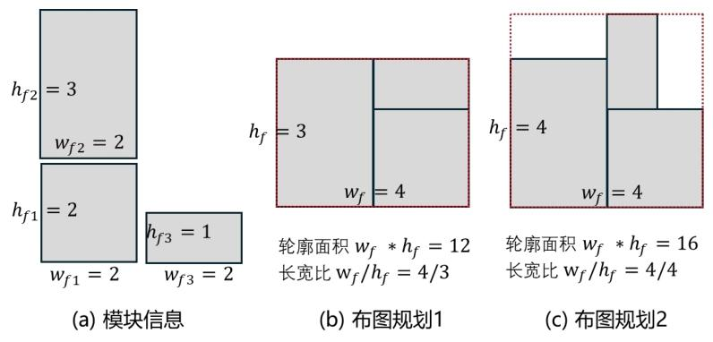
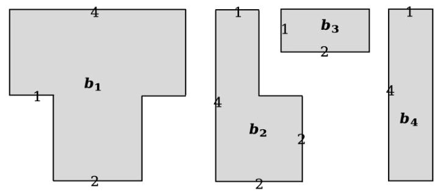

# 2026 第七届“华数杯”大学生数学建模竞赛 B题 VLSI布图规划设计
## 一、题目背景
超大规模集成电路(VLSI,Very Large Scale Integration)将大量电路单元集成于单一芯片。随着设计复杂度增加，如今开展VLSI设计已离不开电子设计自动化(EDA,Electronic Design Automation)工具的支持。EDA作为算法密集型产业，需要对数千种情境进行快速设计探索，是国家关键技术领域。其中，布图规划(Floorplanning)是EDA研究的核心问题之一。

布图规划旨在给定的芯片轮廓内确定各功能模块的位置和方向，为后续的布局和布线奠定基础。芯片轮廓通常为正方形，其尺寸由所有模块的总面积 (total_block_area)和预设的死区比例(dead_space_ratio)共同确定，死区比例反映了布线和其他开销所需的额外空间。芯片轮廓的尺寸计算如公式(1)所示，则芯片的左下角坐标和右上角坐标分别为$(0,0)$ 和$(w_{f}, h_{f})$。
$$w_{f}=h_{f}=\sqrt{ total\_block\_area \times (1+ dead\_space_ratio )} \tag{1}$$

通常情况下，布图规划的目标是功能模块间的总连线长度最小，同时满足模块之间不重叠、不超出芯片轮廓等约束条件。每个模块都为矩形，允许进行90度旋转以获得更好的布局效果。模块间的连接关系通过连线网络描述，每个网络连接若干个模块的引脚，网络的连线长度采用半周长线长(Half Perimeter Wirelength, HPWL)进行估算，即连接所有引脚的最小包围矩形的周长的一半。为简化问题，假设所有模块的引脚均位于模块的几何中心位置。



## 二、问题要求
### 问题1
假设芯片轮廓不固定，模块之间也没有连接关系。请问如何摆放模块，使得芯片轮廓面积最小；在轮廓的面积相同的情况下，其长宽比越接近1则结果越好。
根据所建立的模型和`.blocks`文件信息，对附件中的三组芯片(n100、n200、n300)分别完成模块摆放(即确定`.blocks`文件中类型为block的模块位置，每组芯片独立布图)，分别给出三组芯片轮廓的面积、长宽比、模块摆放的可视化结果。



### 问题2
实际场景中，芯片轮廓通常为正方形，其尺寸由公式(1)确定，模块之间也会有连接关系。请问如何摆放模块，使得模块之间总HPWL最小，同时满足模块之间不重叠、不超出芯片轮廓的约束条件。
假设死区比例为0.15，请根据所建立的模型和附件信息，对附件中的三组芯片完成模块摆放，分别给出三组芯片的总连线长度、模块摆放的可视化结果。

### 问题3
在问题2的基础上，为满足模块之间不重叠、不超出芯片轮廓的约束条件，死区比例最小可以是多少(见公式1，随着死区比例减小，芯片轮廓尺寸逐渐减小，布图越难以满足约束条件。即求解使得存在一个可行布局方案的最小死区比例)。
请分别给出附件中三组芯片的死区比例最小值，并基于问题2所建立的模型和死区比例最小值，更新问题2的总HPWL以及模块摆放的可视化结果。

### 问题4
假设模块不再全是规则的矩形，而可能是L型和T型，且所有模块均可以进行90°、180°和270°旋转。请讨论问题1所建立的模型如何修正？求解算法可在问题1算法基础上适当修改，不要求重新设计新的优化算法。
为验证修正后的模型的有效性，现给出4个待摆放模块，请基于你修正后的模型，求解如何摆放这4个模块使得包围他们的芯片轮廓面积最小，给出最优摆放的示意图及此时的最小面积。



## 三、参考文献
[1]半周长线长HPWL. https://www.bohrium.com/sciencepedia/feynman/keyword/half_perimeter_wirelength
[2]Modern Floorplanning Based on B ∗-Tree and Fast Simulated Annealing. https://cc.ee.ntu.edu.tw/~ywchang/Papers/tcad06mfloorplanning.pdf
[3]黄志鹏, 李兴权, 朱文兴. "超大规模集成电路布局的优化模型与算 法." 运筹学学报25, no. 3 (2021): 15-36.

## 四、附件说明
附件包含3 组芯片设计文件，分别为n100,n200,n300。每组芯片设计包含文件如下：
### 1. `.blocks` 文件
描述功能模块的基本信息。功能模块分为两类：
1. HardBlock：需要确定摆放位置和方向；
2. Terminal：位置和方向都已固定的模块。

功能模块的名称、类型、尺寸均在该文件中给出。Terminal尺寸对解题并无帮助，因此略去其尺寸信息。Terminal仅作为固定引脚参与HPWL计算，不参与面积约束和重叠约束。

文件格式示例：
```
NumHardBlocks:5
// 待确定位置和方向的blocks 总个数
NumTerminals:32
// 固定位置的terminals 的总个数
b0 block 4 \((0,0)\) (0,82) (199,82) (199,0) // 模块名称 类型 边角个数 四点坐标
p1 terminal // 模块名称 类型
```

### 2. `.nets` 文件
描述连线网络（线网）的基本信息。在优化线网的 HPWL 指标时，仅需要关注线网的所有引脚坐标组成的外接矩形的半周长，不用考虑引脚内部具体如何连线。

文件格式示例：
```
NumNets:10
// 线网的总个数
NumPins:20 // 引脚的总个数
// NetDegree:2 // 每个线网有多少个引脚
p1 b0 // 引脚所属节点
```

### 3. `.pl` 文件
描述Terminal 的基本信息，包括名称、X 坐标和Y 坐标。
文件格式示例：
```
p1 0 0 // Terminal名称 X坐标 Y坐标
```

## 五、关键概念补充（Terminal / HardBlock）
1. **HardBlock**
    可平移、90°旋转的矩形/异形电路模块；参与面积计算、重叠约束、芯片边界约束；引脚在自身几何中心，坐标随摆放位置变化。
2. **Terminal**
    芯片对外固定焊盘，坐标永久锁定（`.pl` 文件给定），不可移动、旋转；**仅参与HPWL线长计算**；不占用芯片面积、不参与重叠/边界约束，模块可以与Terminal坐标点重叠。
3. **HPWL计算规则**
    单条线网收集全部关联点（HardBlock中心 + Terminal固定坐标），取所有点X最大/最小值、Y最大/最小值，半周长线长：
    $$HPWL = (X_{max}-X_{min}) + (Y_{max}-Y_{min})$$
    总目标为全部线网HPWL之和最小。
