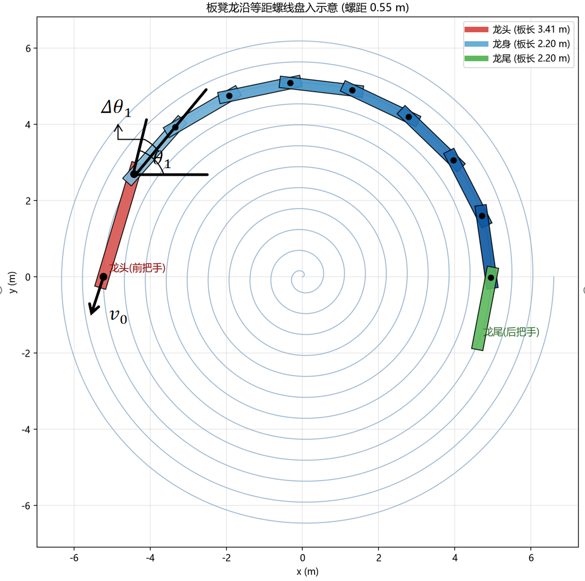
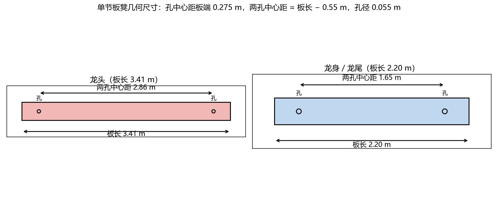
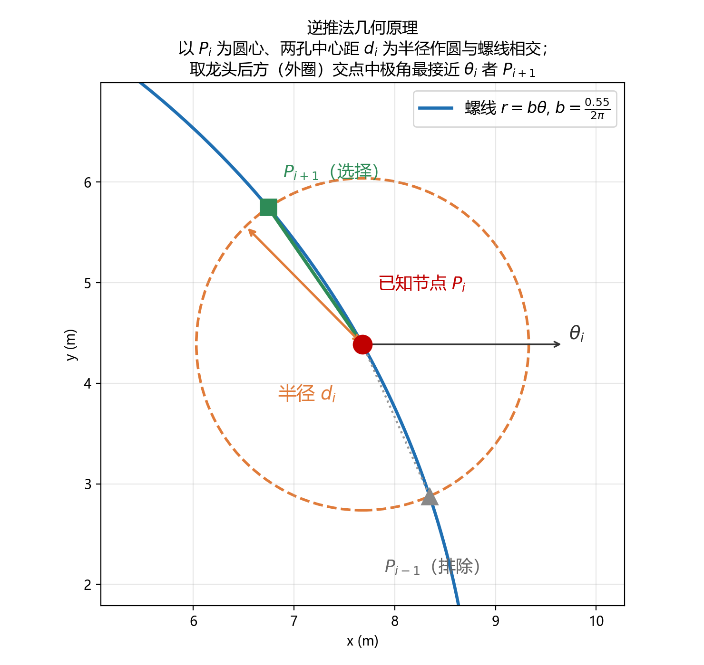

# 问题一的模型建立和求解

## 一、等距约束下的螺线多体运动学模型

题设给出龙头前把手中心始终位于阿基米德螺线（等距螺线）上，且龙头前把手的行进速度恒为 $1\,\mathrm{m/s}$。以螺线中心为极点、龙头初始方向为极轴建立极坐标系，阿基米德螺线的极坐标方程为

$$
r = b\theta
$$

其中参数 $b$ 与螺距 $p$ 满足 $2\pi b = p$。本题螺距 $p = 0.55\,\mathrm{m}$，故

$$
b = \frac{0.55}{2\pi}\ \mathrm{m/rad} \approx 0.0875\ \mathrm{m/rad},
$$

螺线方程记为

$$
\ell: r = b\theta .
$$

由于龙头前把手速度恒为 $1\,\mathrm{m/s}$，任意时刻 $t$ 龙头前把手沿螺线走过的路程恒等于时间 $t$，即

$$
s(t) = t .
$$

沿螺线的弧长微元为

$$
ds = \sqrt{r^2 + \left(\frac{dr}{d\theta}\right)^2}\, d\theta
    = \sqrt{(b\theta)^2 + b^2}\, d\theta
    = b\sqrt{\theta^2 + 1}\, d\theta .
$$

初始时龙头位于螺线第 $16$ 圈，即极角 $\theta_0 = 32\pi$。设时刻 $t$ 龙头前把手的极角为 $\theta(t)$（龙头盘入，$\theta$ 随 $t$ 递减），则由路程等于时间得

$$
t = \int_{\theta(t)}^{32\pi} b\sqrt{\theta^2 + 1}\, d\theta ,
\qquad t \in [0,300] .
$$

对每个时刻 $t$ 数值求解上述方程即得龙头前把手的极角 $\theta(t)$，进而其位置为

$$
P_0(t) = \bigl(b\theta(t)\cos\theta(t),\ b\theta(t)\sin\theta(t)\bigr) .
$$

> 注：初稿中写作 $r = 0.55\,\theta$ 属量纲错误（该式隐含螺距 $2\pi\times0.55=3.456\,\mathrm{m}$）；正确参数应为 $b = 0.55/(2\pi)$，此时第 $16$ 圈半径恰为 $16\times0.55=8.8\,\mathrm{m}$，与赛题一致。

整条板凳龙在某一时刻沿螺线盘入的整体形态如图 1 所示：龙头（红色）位于前沿，龙身（蓝色）与龙尾（绿色）沿已盘过的螺线段依次向外展开。图中标注了第 $1$ 节龙身前把手（即龙头后把手）对应螺线该处的极角 $\theta_1$、龙头至第 $1$ 节龙身之间转过的极角差 $\Delta\theta_1$（即相邻两把手绕极点转过的角度），以及龙头前把手沿螺线切线方向的恒速 $v_0 = 1\,\mathrm{m/s}$。由于各把手中心均落在螺线上，其位置完全由各自的极角确定，而相邻把手的极角差 $\Delta\theta$ 由板凳长度与所在圈半径共同决定——这正是后文逆推法的几何基础。

## 二、逆推法求解各板凳把手中心位置

龙头前把手的位置 $P_0(t)$ 确定后，整条龙其余 $223$ 个把手中心（龙头后把手、各龙身与龙尾的前把手、龙尾后把手）的位置，需借助"各把手中心均位于螺线上"与"相邻把手由刚性板凳连接"两个约束逐节**逆推**求得。

### 2.1 相邻把手的距离约束

每节板凳前后各有一个把手孔，孔心距板端 $0.275\,\mathrm{m}$（图 2），故同一节板凳两孔中心（即该节前后两个把手中心）的直线距离为

$$
d = L - 2\times 0.275 ,
$$

其中 $L$ 为板长。代入赛题参数：

- 龙头（$L=3.41\,\mathrm{m}$）：$d_0 = 3.41 - 0.55 = 2.86\,\mathrm{m}$；
- 龙身、龙尾（$L=2.20\,\mathrm{m}$）：$d = 2.20 - 0.55 = 1.65\,\mathrm{m}$。

相邻把手沿链顺序排列 $P_0, P_1, \dots, P_{223}$（$P_0$ 为龙头前把手，$P_{223}$ 为龙尾后把手），相邻两点距离由其间那节板凳决定：

$$
|P_{i+1} - P_i| = d_i , \qquad
d_i = \begin{cases}
2.86, & i = 0 \text{（龙头），}\\
1.65, & i = 1,2,\dots,222 \text{（龙身、龙尾）。}
\end{cases}
$$

### 2.2 逆推过程（几何作图法）

已知节点 $P_i$ 的坐标，求解下一节点 $P_{i+1}$ 的坐标，步骤如下（图 3）：

1. **作圆**：以已知节点 $P_i$ 为圆心、该节板凳两孔中心距 $d_i$ 为半径作圆 $C_i$；
2. **求交点**：圆 $C_i$ 与螺线 $\ell$ 相交。由于阿基米德螺线绕行多圈，圆与螺线一般存在多个交点：除本圈上相邻的两个把手位置外，还包含螺线其他圈上的交点（极角相差约 $2\pi$ 的整数倍）；
3. **选点**：相邻把手沿螺线顺序衔接，且龙头后方（已盘过的螺线段）极角 $\theta$ 随半径增大而增大，因此 $P_{i+1}$ 应位于龙头后方、即极角大于 $\theta_i$ 的一侧。取该侧交点中**极角 $\theta$ 与 $\theta_i$ 最接近**的一个作为 $P_{i+1}$。该准则自动排除螺线其余圈上的候选点；
4. **迭代**：令 $i \leftarrow i+1$，重复上述过程，直至求出龙尾后把手 $P_{223}$。

数学上，上述选点准则等价于求满足下式的 $\theta_{i+1}$：

$$
\bigl|P(\theta_{i+1}) - P(\theta_i)\bigr| = d_i, \qquad
\theta_{i+1} > \theta_i, \qquad
\theta_{i+1} = \arg\min_{\theta\in\mathcal{S}}\ |\theta - \theta_i|,
$$

其中 $\mathcal{S}$ 为方程 $\bigl|P(\theta) - P(\theta_i)\bigr| = d_i$ 在 $\theta > \theta_i$ 一侧的解集。由于板凳长度（$1.65\sim2.86\,\mathrm{m}$）远小于所在圈半径，在 $\theta_i$ 附近该方程恰有一个根，可用二分法或牛顿法在 $\theta \in (\theta_i,\ \theta_i+\delta)$（$\delta$ 取约 $0.3\sim0.6\ \mathrm{rad}$）内快速数值求解。数值验证：由龙头起逐节逆推，相邻节点距离均精确收敛于 $d_i$（例如龙头→第 1 节龙身 $2.86\,\mathrm{m}$，其后各节 $1.65\,\mathrm{m}$），极角增量约 $0.19\ \mathrm{rad}$，与几何预期一致。

将上述逆推对每个离散时刻 $t_k$（每秒一个采样点）执行一遍，即得 $0\sim300\,\mathrm{s}$ 内整条龙全部 $224$ 个把手中心的位置。

### 2.3 各把手速度

各把手的速度可对其位置关于时间做数值差分得到，例如取相邻采样时刻的中心差分

$$
v_i(t_k) = \frac{\bigl|P_i(t_{k+1}) - P_i(t_{k-1})\bigr|}{2\Delta t},
\qquad \Delta t = 1\,\mathrm{s}.
$$

龙头前把手的速度由此自然满足 $v_0 \approx 1\,\mathrm{m/s}$，与题设自洽。

此外，各把手速度也可由**速度分解（刚体铰接链速度递推）**求得，作为上述差分的独立验证。记螺线在极角 $\theta$ 处的单位切向量为

$$
T(\theta) = \frac{dP/d\theta}{|dP/d\theta|} ,
$$

由于各把手中心均位于螺线上，$P_i$ 的速度方向必沿螺线切线，即 $v_i = v_i\, T(\theta_i)$。又相邻把手由刚性板凳连接，杆两端沿杆方向的速度投影相等：

$$
v_i \cdot e_i = v_{i+1} \cdot e_i ,
\qquad
e_i = \frac{P_{i+1} - P_i}{|P_{i+1} - P_i|} ,
$$

故由龙头前把手 $v_0 = 1\,\mathrm{m/s}$ 出发逐节递推

$$
v_{i+1} = v_i\, \frac{T(\theta_i)\cdot e_i}{T(\theta_{i+1})\cdot e_i} .
$$

数值验证：对 $t=50\,\mathrm{s}$ 时刻逐节递推得到 $v_{0}=1.0000$、$v_{222}=0.9992\ \mathrm{m/s}$，与中心差分结果（$0.9975\sim0.9978\ \mathrm{m/s}$）最大相差约 $0.002\ \mathrm{m/s}$，吻合良好，二者互相验证。这一结果也与"整条刚性链沿固定螺线无伸长滑移，故各把手弧长速率应相同"的物理预期一致——各把手速度大小均近似等于龙头前把手速度 $1\,\mathrm{m/s}$。

## 附图

**图 1　板凳龙沿螺线盘入整体示意**（龙头=红、龙身=蓝、龙尾=绿；标注 $\theta_1$、$\Delta\theta_1$、$v_0$）

**图 2　单节板凳几何尺寸示意**（龙头 / 龙身、龙尾，含两孔位置与孔径）

**图 3　逆推法几何原理示意**（以已知节点为圆心作圆、与已盘过螺线相交、取极角最接近交点）

