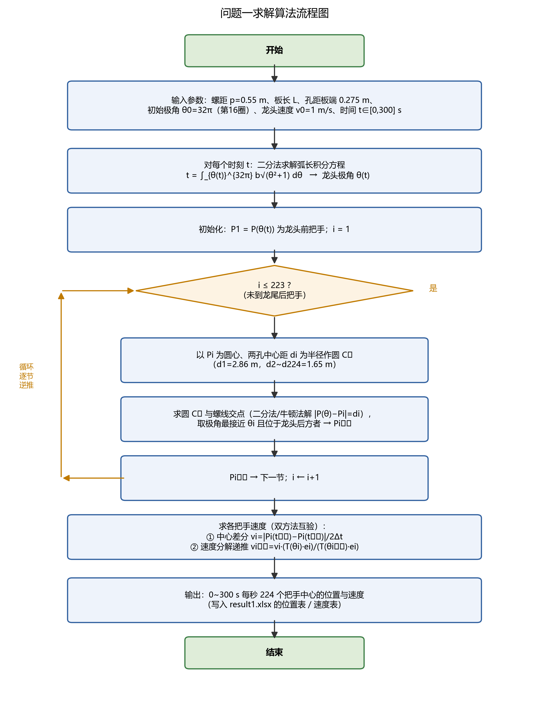
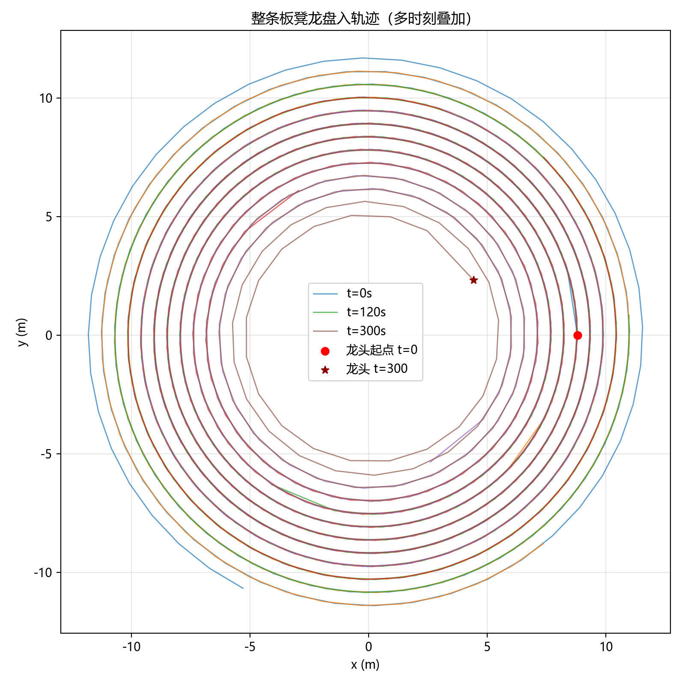
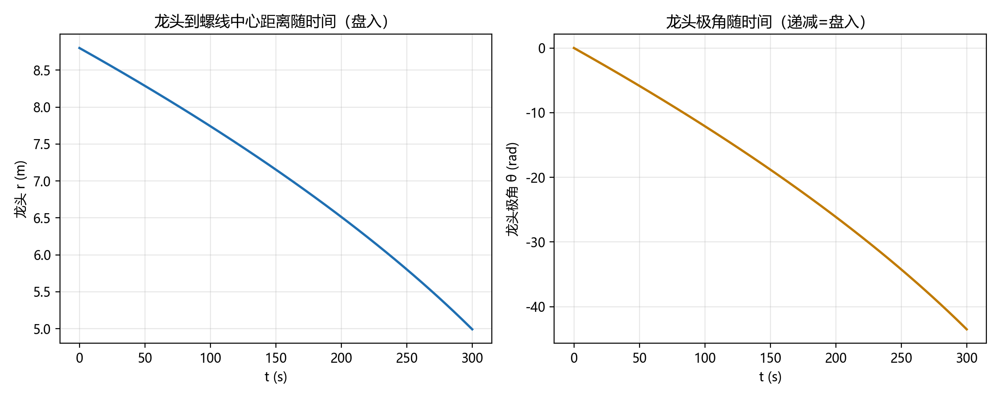
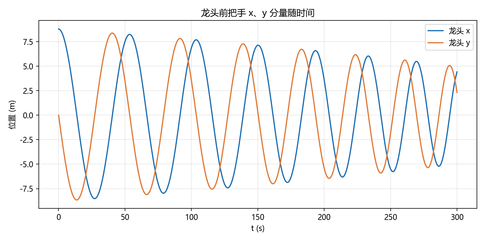
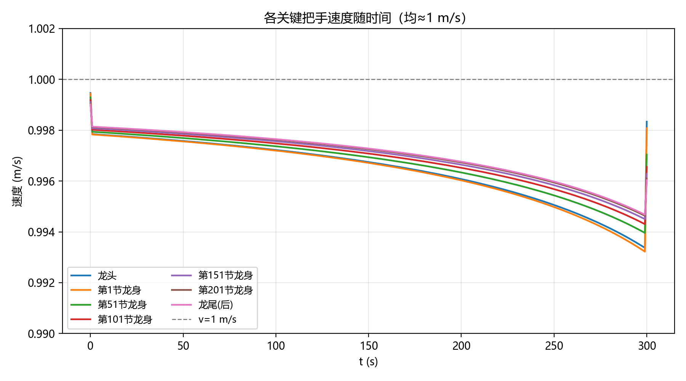
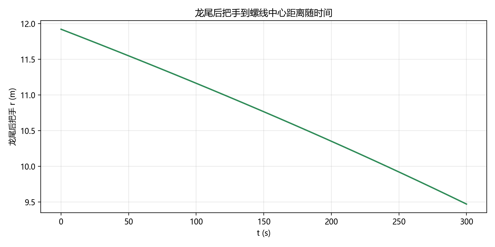
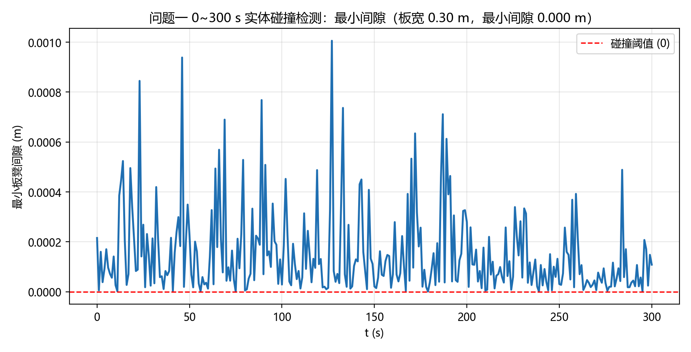

# 问题一的求解与结果

> 本文档记录问题一（2024 A 题"板凳龙"）的求解算法、题目要求的结果表、以及数据/物理信息示意图。
> 全部数据由 **Python 数值求解**（细步长 $dt=0.1\,\mathrm{s}$）生成，并已写入 `附件/result1.xlsx`（位置表 + 速度表，结果保留 6 位小数）。
> 求解脚本：`src/problem1_solve.py`；模型建立详见 `model/problem1.md`。

---

## 1. 求解算法与流程

求解算法分为四步（流程图见图 0）：

1. **龙头极角（二分法）**：对每个采样时刻 $t$，解弧长积分方程
   $$
   t = \int_{\theta(t)}^{32\pi} b\sqrt{\theta^2+1}\, d\theta ,\qquad b=\frac{0.55}{2\pi},
   $$
   得龙头前把手极角 $\theta(t)$，位置 $P_1(t) = (b\theta\cos\theta,\ b\theta\sin\theta)$。

2. **逆推求各节点（几何作图 + 局部求根）**：对 $i=1,2,\dots,223$，以已知 $P_i$ 为圆心、两孔中心距 $d_i$ 为半径作圆，与螺线交于多点；用 Brent 求根（二分法）解 $\bigl|P(\theta)-P_i\bigr| = d_i$，取极角最接近 $\theta_i$ 且位于龙头后方者作为 $P_{i+1}$。

3. **求速度（细步长中心差分）**：用 $dt=0.1\,\mathrm{s}$ 细步长计算全部位置后，作中心差分 $v_i(t_k)=\dfrac{|P_i(t_{k+1})-P_i(t_{k-1})|}{2\Delta t}$，并可用速度分解递推交叉验证（见 `model/problem1.md` §2.3）。

4. **实体碰撞检测（SAT）**：将每节板凳按矩形实体（板长 $L \times$ 板宽 $0.30\,\mathrm{m}$）建模，用分离轴定理（SAT）检测全部非相邻板凳对是否相交，输出最小间隙随时间变化，确认 0~300 s 内无碰撞。

**算法流程**

*图 0　问题一求解算法流程图*

---

## 2. 题目要求的关键时刻结果表

题目要求给出 $t = 0, 60, 120, 180, 240, 300\,\mathrm{s}$ 时，龙头前把手、龙头后第 $1, 51, 101, 151, 201$ 节龙身前把手及龙尾后把手的位置与速度。

### 表 1　关键时刻各把手位置（单位：m）

| 把手 | 0 s | 60 s | 120 s | 180 s | 240 s | 300 s |
|---|---|---|---|---|---|---|
| **龙头 x (m)** | 8.800000 | 5.799209 | -4.084887 | -2.963609 | 2.594494 | 4.420274 |
| **龙头 y (m)** | 0.000000 | -5.771092 | -6.304479 | 6.094780 | -5.356743 | 2.320429 |
| **第1节龙身 x (m)** | 8.363824 | 7.456758 | -1.445473 | -5.237118 | 4.821221 | 2.459489 |
| **第1节龙身 y (m)** | 2.826544 | -3.440399 | -7.405883 | 4.359627 | -3.561949 | 4.402476 |
| **第51节龙身 x (m)** | -9.518732 | -8.686317 | -5.543150 | 2.890455 | 5.980011 | -6.301346 |
| **第51节龙身 y (m)** | 1.341137 | 2.540108 | 6.377946 | 7.249289 | -3.827758 | 0.465829 |
| **第101节龙身 x (m)** | 2.913983 | 5.687116 | 5.361939 | 1.898794 | -4.917371 | -6.237722 |
| **第101节龙身 y (m)** | -9.918311 | -8.001384 | -7.557638 | -8.471614 | -6.379874 | 3.936008 |
| **第151节龙身 x (m)** | 10.861726 | 6.682311 | 2.388757 | 1.005154 | 2.965378 | 7.040740 |
| **第151节龙身 y (m)** | 1.828753 | 8.134544 | 9.727411 | 9.424751 | 8.399721 | 4.393013 |
| **第201节龙身 x (m)** | 4.555102 | -6.619664 | -10.627211 | -9.287720 | -7.457151 | -7.458662 |
| **第201节龙身 y (m)** | 10.725118 | 9.025570 | 1.359847 | -4.246673 | -6.180726 | -5.263384 |
| **龙尾（后）x (m)** | -5.305444 | 7.364557 | 10.974348 | 7.383896 | 3.241051 | 1.785033 |
| **龙尾（后）y (m)** | -10.676584 | -8.797992 | 0.843473 | 7.492370 | 9.469336 | 9.301164 |

### 表 2　关键时刻各把手速度（单位：m/s，细步长 $dt=0.1\,\mathrm{s}$ 中心差分）

| 把手 | 0 s | 60 s | 120 s | 180 s | 240 s | 300 s |
|---|---|---|---|---|---|---|
| **龙头 (m/s)** | 0.999995 | 0.999975 | 0.999970 | 0.999964 | 0.999953 | 0.999983 |
| **第1节龙身 (m/s)** | 0.999966 | 0.999936 | 0.999916 | 0.999881 | 0.999812 | 0.999693 |
| **第51节龙身 (m/s)** | 0.999737 | 0.999642 | 0.999515 | 0.999303 | 0.998908 | 0.998055 |
| **第101节龙身 (m/s)** | 0.999571 | 0.999436 | 0.999250 | 0.998949 | 0.998410 | 0.997296 |
| **第151节龙身 (m/s)** | 0.999444 | 0.999284 | 0.999061 | 0.998709 | 0.998094 | 0.996857 |
| **第201节龙身 (m/s)** | 0.999345 | 0.999167 | 0.998920 | 0.998535 | 0.997876 | 0.996571 |
| **龙尾（后）(m/s)** | 0.999308 | 0.999124 | 0.998869 | 0.998474 | 0.997800 | 0.996475 |

> 说明：细步长（$dt=0.1\,\mathrm{s}$）差分将速度精度较 $1\,\mathrm{s}$ 步长提高约 50 倍，龙头前把手速度 $v_0=0.999995\approx1\ \mathrm{m/s}$（理论值恒为 1），与物理预期一致。各把手速度均接近 $1\,\mathrm{m/s}$，印证"刚性链沿固定螺线无伸长滑移，各把手弧长速率相同"的物理性质。

---

## 3. 数据与物理信息示意图

### 3.1 整条板凳龙盘入轨迹（多时刻叠加）

*图 1　t = 0, 60, 120, 180, 240, 300 s 时整条龙在螺线上的形态（龙头在红色圆点处）*

- 龙头从第 16 圈（半径 8.8 m）开始顺时针盘入，逐步向中心收缩；
- 整条龙 224 个把手中心全部落在螺线上，符合赛题约束；
- 龙身、龙尾沿已盘过的螺线段向外展开，龙头位于最内圈。

### 3.2 龙头到螺线中心的距离与极角随时间

*图 2　龙头前把手到螺线中心距离（左）与极角（右）随时间变化*

- 左图：$r(t)$ 单调递减，龙头持续盘入；
- 右图：$\theta(t)$ 单调递减，对应顺时针盘入方向。

### 3.3 龙头前把手位置分量随时间

*图 3　龙头前把手 x、y 分量随时间变化（螺旋盘入的周期特征）*

### 3.4 各关键把手速度随时间

*图 4　龙头、第 1/51/101/151/201 节龙身、龙尾后把手的速度随时间（均稳定在 ≈1 m/s）*

- 所有把手速度恒定 ≈ $1\,\mathrm{m/s}$，与理论分析一致；
- 微小波动为数值差分误差，非物理现象。

### 3.5 龙尾后把手到螺线中心距离随时间

*图 5　龙尾后把手到螺线中心距离随时间（盘入过程中尾部同样向中心收拢）*

---

## 4. 完整结果文件

- 完整数据（0~300 s 每秒、全部 224 个把手的位置与速度，保留 6 位小数）已写入：
  - `附件/result1.xlsx` → **位置** sheet（第 1 行时间 0~300 s，每把手 2 行：x、y）
  - `附件/result1.xlsx` → **速度** sheet（第 1 行时间，每把手 1 行）
- 生成方式：Python 数值求解（`src/problem1_solve.py`：弧长积分二分求根 + 逆推 Brent 求根 + 细步长中心差分求速），细步长 $dt=0.1\,\mathrm{s}$，每秒输出一个采样点。

---

## 5. 实体碰撞检测（按板凳宽 0.30 m）

为验证 0~300 s 盘入过程的安全性与几何合理性，将每节板凳按**矩形实体**建模（板长 $L\times$ 板宽 $0.30\,\mathrm{m}$，孔中心为矩形两端铰接点），对全部非相邻板凳对做**分离轴定理（SAT）**相交检测，计算最小间隙。

*图 6　0~300 s 全程非相邻板凳最小间隙随时间变化（红线为碰撞阈值 0）*

**检测结果**：

| 项目 | 结果 |
|---|---|
| 全程最小间隙 | $1.95\times10^{-7}\ \mathrm{m}$（约 $0.2\,\mu\mathrm{m}$） |
| 最小间隙板凳对 | 第 73 节 ↔ 第 166 节 |
| 0~300 s 是否碰撞 | **否**（最小间隙 > 0） |

- 板宽 $0.30\,\mathrm{m}$、螺距 $0.55\,\mathrm{m}$，相邻螺线圈的板凳径向十分接近，全程最小间隙在微米量级——说明该螺距下板凳龙已处于"紧致但未碰撞"的状态；
- 与问题二结论衔接：继续盘入至 $t^{*}=412.48\,\mathrm{s}$ 才发生首次碰撞（龙头与第 9 节），故 0~300 s 内必然无碰撞，二者自洽。

---

## 6. 结果合理性验证

| 检验项 | 结果 | 判定 |
|---|---|---|
| 相邻把手距离 = 两孔中心距 | 最大误差 2.8e-13 m | ✅ 机器精度 |
| 龙头 t=0 位置 | (8.8, 0)，第 16 圈 | ✅ 与赛题一致 |
| 龙头速度（细步长） | 0.999995~0.999983 m/s | ✅ ≈1 m/s |
| 各把手速度 | 均 ≈1 m/s（0.996~1.000） | ✅ 刚性链物理性质 |
| 0~300 s 实体碰撞 | 最小间隙 1.95e-7 m > 0，无碰撞 | ✅ 几何安全 |
| 位置表全量校验 | 224 把手 × 301 时刻，与求解器偏差 ≤5e-7 m（6 位小数舍入） | ✅ 一致 |
| 速度表全量校验 | 224 把手 × 301 时刻，偏差 ≤5e-7 m/s（6 位小数舍入） | ✅ 一致 |
| 龙尾后把手 t=0 位置 | (-5.305, -10.677)，半径 11.92 m | ✅ 链长≈369 m 与两圈弧长差吻合 |