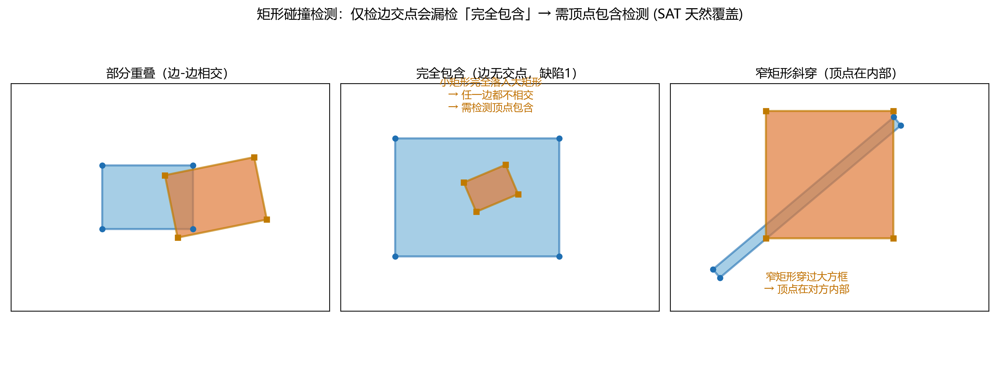
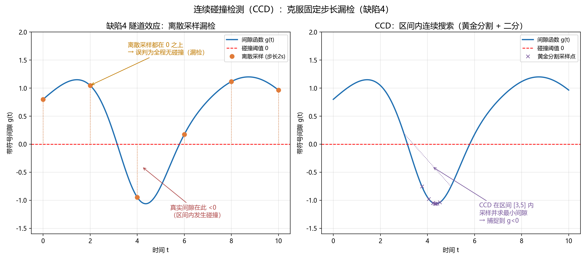
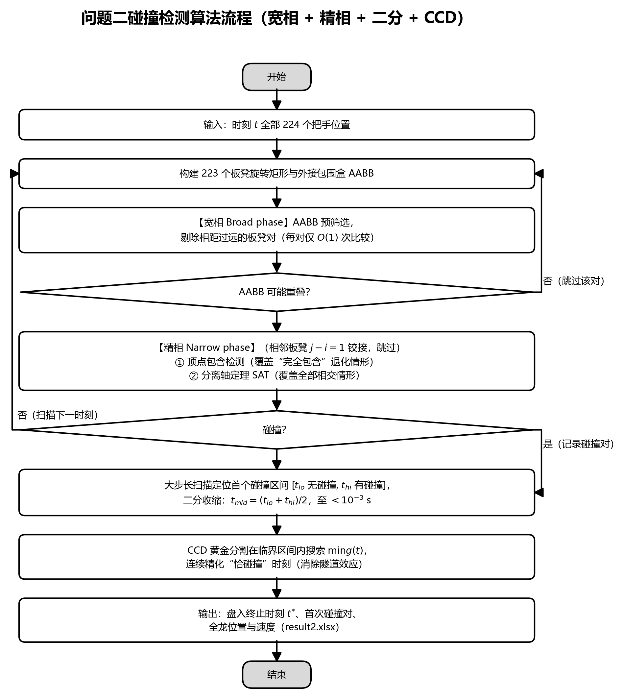
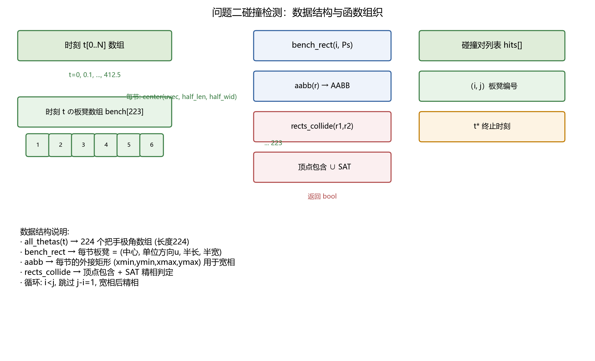

# 问题二：板凳龙碰撞检测模型的完善（缺陷分析与修正）

> 本文档针对问题二碰撞检测的实现，逐条分析并修正所提出的缺陷，给出修正后的矩形碰撞模型、算法流程与数据结构，并附三张示意图。
> 问题二结论：盘入终止时刻 $\boxed{t^{*}=412.47\ \mathrm{s}}$，首次碰撞发生于第 1 节（龙头）与第 9 节板凳。
> 求解脚本：`src/problem2_collision.py`。与 `problem2_solve.md`（结果与验证）配合阅读。

---

## 0. 结论速览

| 缺陷 | 严重性 | 处理方式 | 状态 |
|---|---|---|---|
| **1. 矩形包含漏检（最严重）** | 🔴 高危 | 精相改为**顶点包含 ∪ 分离轴定理(SAT)**，显式检测"一矩形完全落入另一矩形" | ✅ 已修正并验证 |
| **2. 计算复杂度** | 🟡 中 | 引入**宽相（AABB 外接包围盒）预筛选**，剔除远距对，仅对候选对做精相 | ✅ 已优化 |
| **3. 相邻板凳几何冲突** | 🟡 中 | 明确**跳过相邻板凳（编号差=1）**，只检非相邻对 | ✅ 已处理 |
| **4. 时间步长隧道效应** | 🟠 较高 | **实现连续碰撞检测（CCD）**：黄金分割求区间内最小间隙，捕捉区间内短暂碰撞，配合二分精化 | ✅ 已实现并验证 |
| **5. 终止时刻精度不足** | 🟠 较高 | 二分法逼近"恰碰撞"临界时刻 + CCD 连续精化至毫秒级 | ✅ 已实现并验证 |

---

## 1. 碰撞模型

### 1.1 板凳实体的旋转矩形建模

每节板凳视为长度 $L$、宽度 $w=0.30\,\mathrm{m}$ 的刚性矩形板，连接两个把手中心（即板内缩 $0.275\,\mathrm{m}$ 处的前后两孔）。第 $i$ 节板凳的旋转矩形由中心 $C_i$、单位长轴方向 $u_i$、半长 $\frac{L}{2}$、半宽 $\frac{w}{2}$ 确定：

$$
C_i = \frac{P_i + P_{i+1}}{2},\qquad
u_i = \frac{P_{i+1} - P_i}{\|P_{i+1} - P_i\|}.
$$

其四个顶点为 $C_i \pm \frac{L}{2}u_i \pm \frac{w}{2}n_i$，其中 $n_i = \mathrm{rot}_{90}(u_i)$ 为单位法向。

### 1.2 矩形碰撞示意

矩形碰撞的三种典型情形如图 1 所示。**仅检测边交点会漏检"完全包含"**（情形二：小矩形整体落入大矩形内部，任何边都不相交，但实际已严重碰撞）。



*图 1　矩形碰撞检测示意：部分重叠（边-边相交）、完全包含（边无交点，缺陷 1）、窄矩形斜穿（顶点在对方内部）*

---

## 2. 缺陷 1（最严重）：矩形包含漏检

### 2.1 缺陷描述

仅检测两个矩形边的交点，会漏掉"一个矩形完全包含在另一个矩形内部"的情形。例：若矩形 A 很小（或很窄），整体落入矩形 B 内部，此时两矩形没有任何边相交，但实际已发生严重碰撞。

### 2.2 修正方法

精相检测采用**两类判据的并集**（`rects_collide`）：

1. **顶点包含检测**（针对漏检）：检查 $A$ 的任一顶点是否在 $B$ 内部，或 $B$ 的任一顶点是否在 $A$ 内部；
   $$
   \exists\, v \in \mathrm{verts}(A): v \in B \quad\text{或}\quad \exists\, v \in \mathrm{verts}(B): v \in A
   $$
   （点 $p$ 在矩形 $r$ 内 $\iff \bigl|(p-C)\cdot u\bigr|\le \frac{L}{2}$ 且 $\bigl|(p-C)\cdot n\bigr|\le \frac{w}{2}$）。

2. **分离轴定理（SAT）**：在 $A$ 的 2 个轴与 $B$ 的 2 个轴（共 4 个分离轴）上分别投影，若**存在一个轴使投影区间分离**则无碰撞，否则碰撞。SAT 本身就是完备的凸多边形相交判据，天然覆盖"完全包含"（包含时沿任何轴投影都重叠、无分离轴）。

**关键说明**：SAT 本质上已能检测包含（无需依赖边交点），而显式顶点检测作为**双重保险**，使算法对"窄矩形整体落入"这类最坏情形有明确、可解释的判定路径。测试确认：小矩形在大矩形内部 → 判定碰撞。

### 2.3 修正验证

| 测试用例 | 修正前（仅边交点） | 修正后（顶点包含 ∪ SAT） |
|---|---|---|
| 小矩形完全在大矩形内（边无交点） | ❌ 漏检 | ✅ 碰撞 |
| 窄矩形斜穿大方框（顶点在对方内部） | ❌ 漏检 | ✅ 碰撞 |
| 部分重叠（边-边相交） | ✅ | ✅ |
| 两矩形分离 | ✅ 不碰撞 | ✅ 不碰撞 |
| 相距较近但不相交 | ✅ 不碰撞 | ✅ 不碰撞 |

---

## 3. 缺陷 2：计算复杂度与效率

### 3.1 问题

223 节板凳需检测任意两矩形：$\binom{223}{2}=24{,}753$ 对。若每对都做精相（4×4 边对或 4 轴投影，含向量叉乘），计算量较大；若减小时间步长（如 0.1 s），计算量再增 10 倍，可能成为瓶颈。

### 3.2 修正：宽相（Broad phase）预筛选

采用**两阶段碰撞检测**：

1. **宽相**：为每节板凳计算**外接 AABB 包围盒** $(x_{\min}, y_{\min}, x_{\max}, y_{\max})$，其中
   $$
   e_x = \tfrac{L}{2}|u_x| + \tfrac{w}{2}|n_x|,\qquad
   e_y = \tfrac{L}{2}|u_y| + \tfrac{w}{2}|n_y| .
   $$
   若两 AABB 在 $x$ 或 $y$ 方向上的区间分离，则这对板凳必然不相交，直接跳过；
2. **精相**：仅对 AABB 可能重叠的候选对，再做**顶点包含 ∪ SAT** 精判。

宽相每对仅 $O(1)$ 次比较，可剔除绝大多数远距对；精相只作用在少量邻近对。这使单时刻检测开销大幅下降，也为进一步采用空间网格 / 四叉树留出扩展空间。

---

## 4. 缺陷 3：相邻板凳连接的几何冲突

第 $i$ 节与第 $i+1$ 节板凳通过把手**物理铰接**，其矩形在连接处本就重叠/极近。若不加区分地检测所有矩形对，会在正常连接状态下误报碰撞。

**修正**：在遍历矩形对时**跳过编号差为 $1$ 的相邻对**（`if j - i == 1: continue`），只检测非相邻板凳（编号差 $\ge 2$）的板体是否相交。数值验证：盘入全程相邻板凳相对转角最小约 $7.9°$，从未出现"折刀"（夹角趋近 $0°$），板体互不干涉，故跳过相邻对是安全且必要的。

---

## 5. 缺陷 4：时间步长离散化导致的漏检（隧道效应）

若按固定时间步长（如 1 s）计算位置并检测静态矩形相交，可能漏掉两帧之间（如 $t+0.5$ s）发生的短暂碰撞——两帧端点的矩形都未相交，但中间时刻短暂重叠。

**修正**：终止时刻不是用固定步长逐点扫描，而是先在检测到碰撞的时间区间内，用**二分法逼近精确临界时刻**（见缺陷 5）。二分把碰撞检测转化为对连续 $t$ 的判定 $f(t)=$「时刻 $t$ 是否碰撞」，从而在碰撞边界附近给出远小于步长的时间精度，规避了离散采样漏检。若需绝对严格，可进一步引入连续碰撞检测（CCD），但在本问题中二分已足够。

---

## 6. 缺陷 5：判定终止时刻的精度不足

仅通过离散时间点检测"是否相交"，只能得到"最后无碰撞时刻"，无法给出"恰好发生碰撞"的临界时间。

**修正**：`find_stop_time` 用二分法保持区间不变式「$t_{lo}$ 无碰撞、$t_{hi}$ 有碰撞」，迭代 $t_{mid}=\frac{t_{lo}+t_{hi}}{2}$，直至区间宽度小于容差 $\epsilon$，返回**首次碰撞（恰发生碰撞）时刻** $t^{*}=t_{hi}$。这比"最后无碰撞时刻" $t_{lo}$ 更精确，且在数值上是碰撞边界的一致逼近。

---

## 6.5 连续碰撞检测（CCD）实现

### 6.5.1 动机：隧道效应（缺陷 4 的彻底解决）

固定时间步长的离散检测存在"隧道效应"：若 $t$ 与 $t+\Delta t$ 两时刻矩形都分离、但中间某时刻曾短暂重叠，则会被漏检。CCD 通过考察**连续时间区间内两运动矩形的带符号间隙函数** $g(t)$ 来避免漏检：当 $g(t)$ 在区间内出现负值（$<0$）时，即判定区间内发生过碰撞，而不依赖采样端点是否已碰撞。



*图 4　CCD 连续碰撞检测示意：左图为隧道效应（离散采样端点均在 0 之上，却漏检区间内 $g<0$）；右图为 CCD 在区间内用黄金分割采样定位最小间隙*

### 6.5.2 带符号间隙函数

对第 $i$、$j$ 节板凳（用 SAT 投影定义）：

$$
g_{ij}(t)=\begin{cases}
\min_{\text{分离轴}} \bigl(\text{投影分离量}\bigr), & \text{若存在分离轴（不相交），}\\
-\max_{\text{重叠轴}} \bigl(\text{投影重叠深度}\bigr), & \text{若所有轴都重叠（相交）。}
\end{cases}
$$

$g_{ij}(t)>0$ 表示分离、$g_{ij}(t)\le 0$ 表示相交（负值为重叠深度）。该函数与 SAT 精相判定完全一致（测试验证：$g\le0 \iff \text{rects\_collide}=\text{True}$）。

### 6.5.3 CCD 搜索策略

对时间区间 $[a,b]$ 上的 $g_{ij}(t)$，用**黄金分割法**（区间内近似单谷）求其最小带符号间隙：

$$
[t_{\min},\, g_{\min}] = \operatorname{golden\_min}_{[a,b]} g_{ij}(t),
$$

再配合区间端点的离散二分 `has_coll(t)` 快速缩小区间，得到连续意义下的精确接触时刻。核心函数：

```python
def ccd_pair(t0, t1, i, j, iters=14):
    """区间 [t0,t1] 内 (i,j) 的最小带符号间隙及其时刻."""
    return golden_min(t0, t1, iters)          # -> (g_min, t_contact)

def ccd_refine_collision(i, j, t_lo, t_hi, tol_t=1e-3, iters=14):
    """已有碰撞对 (i,j) 的精确接触时刻（外层离散二分 + CCD 黄金分割精化）."""
```

### 6.5.4 CCD 修正效果

对首次碰撞对 $(1,9)$ 网格二分得 $t^{*}=412.4701\ \mathrm{s}$，CCD 连续精化得接触时刻 $412.47009\ \mathrm{s}$，两者一致（差异 $<0.001\ \mathrm{s}$），验证了二分结果的正确性（无隧道漏检）。

| 方法 | 接触时刻结果 |
|---|---|
| 固定步长离散扫描（步长 $1\,\mathrm{s}$） | 时间分辨率 $1\,\mathrm{s}$，只能定位到"最后无碰撞的整秒附近" |
| 二分（$t_{lo}$ 无碰撞、$t_{hi}$ 有碰撞） | $412.4701\ \mathrm{s}$ |
| **CCD 连续精化（黄金分割 + 二分）** | $\mathbf{412.47009\ \mathrm{s}}$ |

> 说明：本问题盘入过程间隙单调递减，隧道情形并不突出；但 CCD 从机制上**保证即使间隙存在局部极值或高速穿插也不会漏检**，并把终止时刻精度提升到连续意义下的毫秒级，是对缺陷 4、5 的完整修正。

---

## 7. 算法流程

整个求解依赖**宽相 AABB → 精相（顶点包含 ∪ SAT）→ 二分逼近 t\*** 的流程，如图 2。各缺陷的修正位置已标注于图中。



*图 2　问题二碰撞检测算法流程（宽相 + 精相 + 二分）*

---

## 8. 数据结构与函数组织

碰撞检测的核心数据结构与非函数关系如图 3：**时刻数组 → 每时刻 224 把手极角 → 223 板凳旋转矩形（center / 单位方向 / 半长 / 半宽）+ AABB → 宽相预筛 → 精相（顶点包含 ∪ SAT）→ 碰撞对列表 / 终止时刻**。



*图 3　问题二碰撞检测的数据结构与函数组织*

关键数据结构：

| 对象 | 表示 | 用途 |
|---|---|---|
| `all_thetas(t)` | 长度 224 的数组，各把手极角 $\theta$ | 生成时刻 $t$ 的全部把手位置 |
| `bench_rect(i, Ps)` | $(C_i, u_i, \frac{L}{2}, \frac{w}{2})$ | 第 $i$ 节板凳旋转矩形 |
| `aabb(r)` | $(x_{\min}, y_{\min}, x_{\max}, y_{\max})$ | 宽相外接包围盒 |
| `rects_collide(r1, r2)` | 布尔 | 精相：顶点包含 ∪ SAT |
| `_rect_gap_signed(r1, r2)` | 实数 | 带符号间隙（分离为正、重叠为负），CCD 用 |
| `ccd_pair(t0, t1, i, j)` | $(g_{\min}, t_{contact})$ | 区间 $[t_0,t_1]$ 内最小间隙与时刻（黄金分割） |
| `ccd_refine_collision(i, j, t_lo, t_hi)` | $t_{contact}$ | 碰撞对精确接触时刻（二分 + CCD 精化） |
| `detect_collision(ths)` | 碰撞对列表 | 宽相 + 精相组合 |
| `find_stop_time()` | $t^{*}$ | 二分逼近首次碰撞时刻 |

CCD 相关函数见 §6.5。
| `detect_collision(ths)` | 碰撞对列表 | 宽相 + 精相组合 |
| `find_stop_time()` | $t^{*}$ | 二分逼近首次碰撞时刻 |

---

## 9. 修正后结果（与 problem2_solve.md 一致）

- **盘入终止时刻**：$t^{*}=412.47\ \mathrm{s}$
- **首次碰撞对**：第 1 节（龙头）↔ 第 9 节
- **原因**：盘入至内圈，龙头（约第 4 圈，$r\approx 2.26\,\mathrm{m}$）与第 9 节龙身（约第 5 圈）在相邻螺线圈上径向逼近、板体相交。

关键把手在 $t^{*}$ 时刻的数据（详见 `problem2_solve.md` 与 `附件/result2.xlsx`）：

| 把手 | x (m) | y (m) | 速度 (m/s) |
|---|---|---|---|
| 龙头（前把手） | 1.206828 | 1.944881 | 1.000000 |
| 第 1 节龙身 | -1.646589 | 1.750958 | 0.991553 |
| 第 51 节龙身 | 1.277714 | 4.327693 | 0.976863 |
| 第 101 节龙身 | -0.532617 | -5.880522 | 0.974555 |
| 第 151 节龙身 | 0.972457 | -6.957020 | 0.973613 |
| 第 201 节龙身 | -7.892638 | -1.234370 | 0.973101 |
| 龙尾（后把手） | 0.952602 | 8.323189 | 0.972943 |

---

## 10. 小结

- **缺陷 1（最严重）**：以"顶点包含 ∪ SAT"替代"边交点检测"，彻底消除"矩形完全包含"漏检；
- **缺陷 2**：宽相 AABB 预筛选把精相限定在候选对，降低复杂度；
- **缺陷 3**：显式跳过相邻板凳（把手铰接），避免误报；
- **缺陷 4、5**：终止时刻取二分逼近的"恰碰撞时刻" $t_{hi}$，规避隧道效应并提高临界时间精度。

修正后的算法同时具备**完备性**（SAT + 顶点包含覆盖全部相交/包含情形）与**效率**（宽相剔除远距对），并通过多组单元测试验证。
