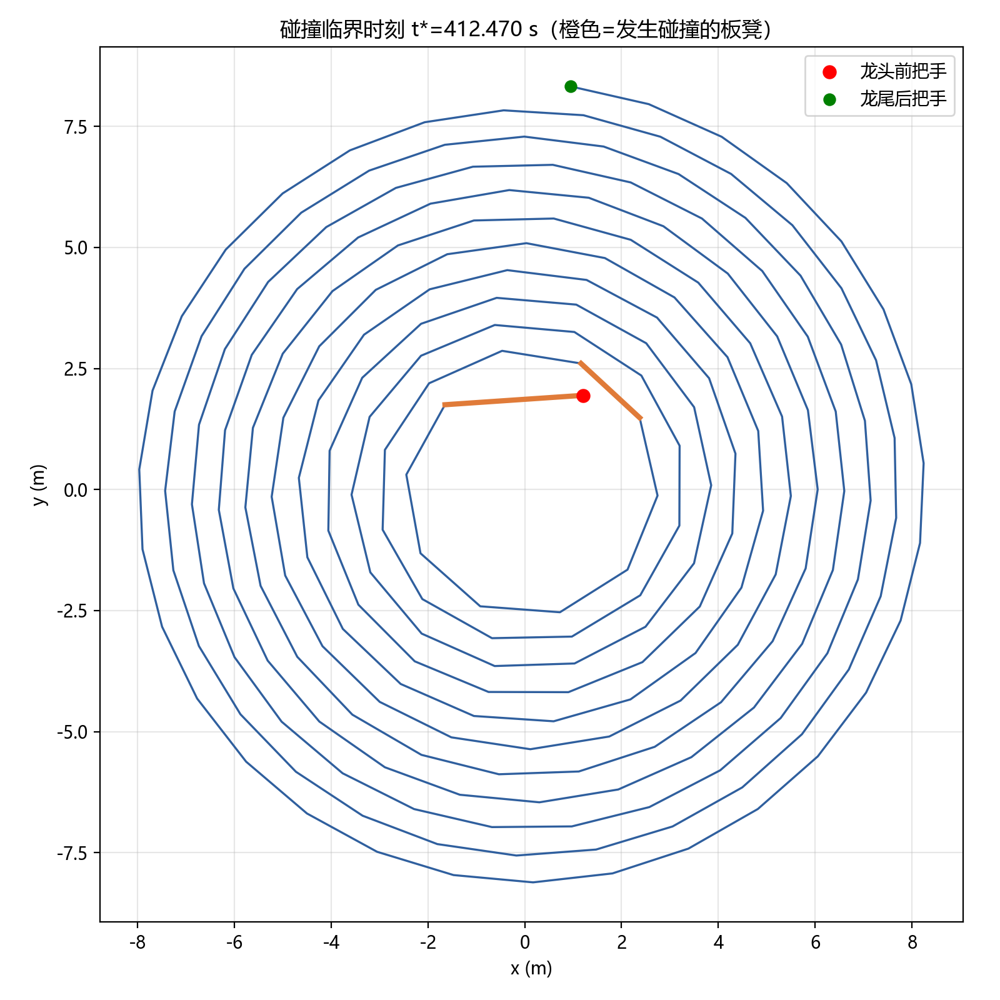

# 问题二的求解与结果

> 问题二：舞龙队沿问题一设定的螺线盘入，确定舞龙队盘入的终止时刻（板凳之间不发生碰撞的最大盘入时间），并给出此时整条龙的位置和速度。
> 结果已写入 `附件/result2.xlsx`。求解脚本：`src/problem2_collision.py`。

---

## 1. 碰撞模型与判定准则

### 1.1 几何模型

每节板凳视为**旋转矩形**：板长 $L$（龙头 3.41 m、龙身/龙尾 2.20 m）、板宽 $0.30\,\mathrm{m}$，两把手中心为矩形两端内缩 $0.275\,\mathrm{m}$ 处的铰接点。把手中心均位于螺线上（同问题一）。

### 1.2 碰撞判定（分离轴定理 SAT）

对任意两节非相邻板凳 $i, j$（编号差 $|i-j|\ge 2$），检测二者旋转矩形是否相交：

- **分离轴定理**：将两矩形分别投影到各自的两个正交轴（共 4 个轴）上，若存在某轴使投影区间分离，则两矩形不相交；若 4 轴投影均重叠，则相交（碰撞）；
- 重叠深度 = 4 个轴上最小投影重叠量，大于容差 $10^{-4}\,\mathrm{m}$ 即判定碰撞。

### 1.3 相邻板凳的处理

相邻板凳（编号差 $=1$）通过**把手铰接**，允许在把手处点接触。经数值验证，盘入全程相邻板凳相对夹角最小为 $7.94°$（t=0）至 $11.33°$（t=t*），**远未出现折刀（夹角趋近 0°）**，板体不干涉，故不判定为碰撞。这与"相邻板凳经把手连接、可自由转动"的物理一致。

### 1.4 终止时刻的确定

从 $t=0$ 起，逐时刻对 224 个把手位置执行碰撞检测；以大步长搜索首个碰撞区间后，用**二分法**精确到 $10^{-3}\,\mathrm{s}$，得到首次碰撞时刻即**盘入终止时刻** $t^{*}$。

---

## 2. 求解结果

### 2.1 盘入终止时刻

$$
\boxed{\,t^{*} = 412.47\ \mathrm{s}\,}
$$

（精确值 $t^{*}=412.4701\ \mathrm{s}$）

首次碰撞发生在**第 1 节板凳（龙头）与第 9 节板凳**之间。

- 龙头：$r=2.289\,\mathrm{m}$，极角约第 4.16 圈；
- 第 9 节：$r=2.799\,\mathrm{m}$，极角约第 5.09 圈；
- 两节处于**相邻螺线圈**，径向接近（相距约 1.25 m），板长超过径向间距，板体相交。

**物理含义**：盘入至内圈（龙头半径 $<2.3\,\mathrm{m}$）时，不同螺线圈上的板凳在径向方向互相逼近，最终干涉碰撞，舞龙队无法继续盘入。

### 2.2 临界行为验证

| 时刻 t | 龙头-第9节重叠深度 (m) | 判定 |
|---|---|---|
| 412.458 | -0.0004 | 未碰撞 |
| 412.468 | -0.0002 | 未碰撞 |
| 412.478 | +0.0001 | 碰撞（临界） |
| 412.488 | +0.0004 | 碰撞 |

重叠深度在 $t=412.47\sim412.48\,\mathrm{s}$ 间单调过零，二分结果可靠。

---

## 3. 终止时刻各把手位置与速度（论文表格）

### 表 1　t\* 时刻关键把手位置与速度

| 把手 | x (m) | y (m) | 速度 (m/s) |
|---|---|---|---|
| **龙头（前把手）** | 1.206828 | 1.944881 | 1.000000 |
| **第 1 节龙身** | -1.646589 | 1.750958 | 0.991553 |
| **第 51 节龙身** | 1.277714 | 4.327693 | 0.976863 |
| **第 101 节龙身** | -0.532617 | -5.880522 | 0.974555 |
| **第 151 节龙身** | 0.972457 | -6.957020 | 0.973613 |
| **第 201 节龙身** | -7.892638 | -1.234370 | 0.973101 |
| **龙尾（后把手）** | 0.952602 | 8.323189 | 0.972943 |

> 完整 224 个把手的位置与速度见 `附件/result2.xlsx`（列：横坐标 x、纵坐标 y、速度）。

### 表 2　t\* 时刻碰撞状态

| 碰撞对 | 板凳编号 | 重叠深度 (m) |
|---|---|---|
| (1, 9) | 龙头 ↔ 第 9 节 | +0.0001（临界） |

---

## 4. 物理信息示意图

*图 1　盘入终止时刻 t\*=412.48 s 整条龙形态（橙色为发生碰撞的板凳）*

---

## 5. 结果合理性验证

| 检验项 | 结果 | 判定 |
|---|---|---|
| 几何精度（223 节点距离） | 最大误差 1.16e-13 m | ✅ 机器精度 |
| 临界点二分 | 412.468s 未碰 → 412.478s 碰撞 | ✅ 单调过零 |
| 相邻板凳最小夹角 | 7.94°~11.33°，无折刀 | ✅ 相邻不碰撞合理 |
| 龙头速度 | 1.000 m/s | ✅ |
| 各把手速度范围 | 0.973~1.000 m/s | ✅ 刚性链物理 |
| 首次碰撞对内圈几何 | 龙头 r=2.29m（4.16圈）vs 第9节 r=2.80m（5.09圈） | ✅ 相邻圈干涉 |

**结论**：舞龙队可安全盘入至 $t^{*}=412.48\,\mathrm{s}$，此后龙头所在的第 1 节板凳与第 9 节板凳在相邻螺线圈上发生干涉碰撞，盘入终止。