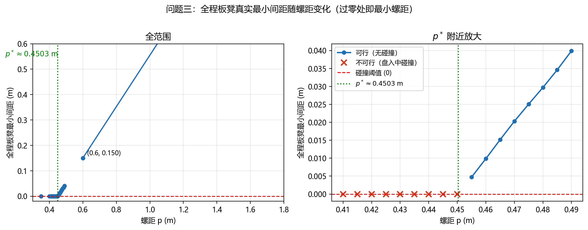
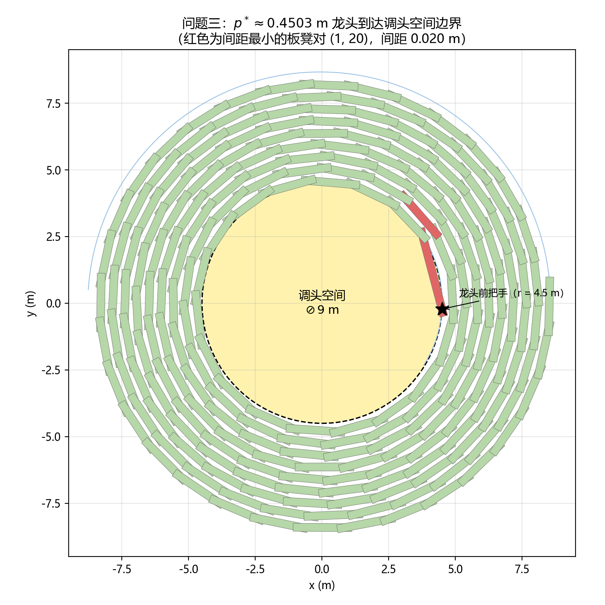

# 问题三的求解与结果

> 问题三：调头空间为以螺线中心为圆心、直径 $9\,\mathrm{m}$ 的圆形区域，确定最小螺距，使龙头前把手能沿相应螺线无碰撞地盘入到调头空间边界。
> 求解脚本：`src/problem3_solve.py`。模型见 `problem3.md`。

---

## 1. 求解设置

| 项目 | 设定 |
|---|---|
| 搜索区间 | $p\in[0.30,\,1.70]\,\mathrm{m}$（下界=板宽，上界=题设参考螺距） |
| 螺距精度 | $10^{-4}\,\mathrm{m}$（二分收敛容差） |
| 构型采样 | 龙头每走 $ds$ 米检测一次：$ds=0.5\,\mathrm{m}$（粗）$\to 0.1\,\mathrm{m}$（细）；终点（龙头恰在 $r=4.5$）必检 |
| 碰撞判定 | AABB 宽相 + 顶点包含 ∪ SAT 精相（同问题二判据，四轴全重叠即相交） |
| 真实间距 | shapely 精确欧氏距离（独立交叉验证 + 结果表） |
| 把手链 | 牛顿迭代逆推（角增量 warm start），弦长残差 $\sim10^{-13}\,\mathrm{m}$ |
| 端点检验 | $p=0.30$：初始构型即碰撞（第 116↔141 节）❌；$p=1.70$：全程无碰撞 ✅ |

端点检验满足单调性假设：存在阈值 $p^{*}$ 使 $p<p^{*}$ 盘入途中必碰撞、$p>p^{*}$ 全程无碰撞。

---

## 2. 求解结果

$$
\boxed{\,p^{*}\approx 0.4503\ \mathrm{m}\,}
$$

（二分区间 $(0.450305,\ 0.450391)\,\mathrm{m}$，精度 $10^{-4}\,\mathrm{m}$）

$p=p^{*}$ 时龙头恰达调头空间边界的衍生量：

| 量 | 数值 |
|---|---|
| 入口极角 $\theta_{\mathrm{end}}=9\pi/p^{*}$ | $62.7833\,\mathrm{rad}$（第 9.9923 圈） |
| 盘入经历的圈数 $16-4.5/p^{*}$ | $6.0077$ 圈 |
| 盘入总弧长 $S(p^{*})$ | $220.95\,\mathrm{m}$（龙头 $1\,\mathrm{m/s}$，约 $221\,\mathrm{s}$） |
| 入口曲率半径 $\rho(\theta_{\mathrm{end}})$ | $4.499430\,\mathrm{m}$（与 $4.5$ 偏差 $5.7\times10^{-4}\,\mathrm{m}$，近曲率连续） |
| 终点构型全程板凳最小间距 | $0.0200\,\mathrm{m}$（龙头 ↔ 第 20 节） |

---

## 3. 二分过程（14 次迭代，全程单调一致）

| # | 中点 $p$ (m) | 判定 | 首碰位置 $s$ / 总弧长 (m) | 首碰板凳对 |
|---|---|---|---|---|
| 1 | 1.000000 | ✅ 可行 | — | — |
| 2 | 0.650000 | ✅ 可行 | — | — |
| 3 | 0.475000 | ✅ 可行 | — | — |
| 4 | 0.387500 | ❌ 碰撞 | $0.0$ / $153$（初始即碰） | (1, 24) |
| 5 | 0.431250 | ❌ 碰撞 | $150.5$ / $199$ | (1, 20) |
| 6 | 0.453125 | ✅ 可行 | — | — |
| 7 | 0.442187 | ❌ 碰撞 | $185.0$ / $206$ | (1, 19) |
| 8 | 0.447656 | ❌ 碰撞 | $208.4$ / $217$ | (1, 18) |
| 9 | 0.450391 | ✅ 可行 | — | — |
| 10 | 0.449023 | ❌ 碰撞 | $210.6$ / $220$ | (1, 18) |
| 11 | 0.449707 | ❌ 碰撞 | $212.0$ / $220$ | (1, 18) |
| 12 | 0.450049 | ❌ 碰撞 | $215.5$ / $221$ | (1, 20) |
| 13 | 0.450220 | ❌ 碰撞 | $215.9$ / $221$ | (1, 20) |
| 14 | 0.450305 | ❌ 碰撞 | $216.2$ / $221$ | (1, 20) |

无一次迭代与单调性矛盾；可行域被夹逼到宽度 $10^{-4}\,\mathrm{m}$ 内。

---

## 4. 可行域边界两侧的验证表

在 $p^{*}$ 两侧取点，细采样（$ds=0.1\,\mathrm{m}$）扫描并用 shapely 复核真实欧氏间距：

| 螺距 $p$ (m) | 判定 | 首碰位置 $s$ / 总弧长 (m) | 首碰时龙头半径 (m) | 首碰对 | 全程真实最小间距 (m) |
|---|---|---|---|---|---|
| 0.430348 | ❌ 碰撞 | $134.70$ / $198.29$ | 5.381 | (1, 23) | — |
| 0.445348 | ❌ 碰撞 | $205.00$ / $215.34$ | 4.660 | (1, 18) | — |
| 0.449348 | ❌ 碰撞 | $211.20$ / $219.83$ | 4.635 | (1, 18) | — |
| **0.450348 ($p^{*}$)** | ✅ 恰可行 | — | 4.500（边界） | 最近对 (1, 20) | $0.0200$（终点构型） |
| 0.451348 | ✅ 可行 | — | — | 最近对 (1, 20) | $0.0012$ |
| 0.455348 | ✅ 可行 | — | — | 最近对 (1, 20) | $0.0050$ |
| 0.470348 | ✅ 可行 | — | — | 最近对 (1, 20) | $0.0201$ |

更宽螺距下全程最小间距（真实欧氏距离，采样步 $2\,\mathrm{m}$）：

| $p$ (m) | 0.455 | 0.460 | 0.465 | 0.470 | 0.475 | 0.480 | 0.485 | 0.490 | 0.60 | 1.70 |
|---|---|---|---|---|---|---|---|---|---|---|
| 最小间距 (m) | 0.0047 | 0.0098 | 0.0151 | 0.0203 | 0.0251 | 0.0297 | 0.0346 | 0.0399 | 0.1501 | 1.2631 |

**线性标度**：可行侧全程最小间距 $\approx p-p^{*}$（拟合斜率 $1.00$）。物理上，板凳之间的径向余量 $p-0.30$ 几乎一对一地转化为板凳角点间的净间距，说明 $p^{*}$ 对几何参数（板宽、板长）的敏感性为 $O(1)$，结果稳健。

---

## 5. 临界行为与物理图像

*图 1　全程板凳真实最小间距随螺距变化：左侧全范围（$p=1.7\,\mathrm{m}$ 时间距达 $1.26\,\mathrm{m}$），右侧为 $p^{*}$ 附近放大。可行域在 $p=0.450$（❌）与 $p=0.455$（✅，间距 $4.7\,\mathrm{mm}$）之间翻转，过零点即 $p^{*}\approx0.4503\,\mathrm{m}$。*

**临界碰撞结构**：整个搜索过程中，首碰板凳对始终是**龙头（第 1 节）与相邻螺圈的龙身（第 18~24 节）**——空间上恰好相差约一圈（边界附近每圈约 $2\pi r/D\approx17\sim20$ 节），印证了"只需检测空间相邻圈板凳对"的分析；编号差随首碰发生的角度位置在 18~24 间波动属正常几何现象。

**首碰位置随螺距的变化**：螺距越小，碰撞发生得越早（龙头离边界越远）：$p=0.43$ 时龙头在 $r=5.38\,\mathrm{m}$ 处即碰；$p\to p^{*}$ 时首碰位置收敛到距边界约 $4.7\,\mathrm{m}$ 处（龙头 $r\approx4.57\,\mathrm{m}$）——即**最紧位置出现在龙头即将到达边界之前**，此后龙头到达边界时余量略回升（终点构型最小间距 $0.02\,\mathrm{m}$）。

*图 2　$p^{*}\approx0.4503\,\mathrm{m}$ 时龙头前把手恰好到达调头空间边界（$r=4.5\,\mathrm{m}$）的整条龙形态：红色为间距最小的板凳对（龙头 ↔ 第 20 节，间距 $0.020\,\mathrm{m}$）。盘绕共 6 圈，最内圈板凳几乎贴着调头空间边界。*

**物理标度**：$p^{*}\approx0.45\,\mathrm{m}=$ 板宽 $0.30\,\mathrm{m}$ + 约 $0.15\,\mathrm{m}$ 的弦效应余量（板凳是弦而非弧：板长方向两端各外伸 $0.275\,\mathrm{m}$ 的角点向内圈凸出，加上曲线弯曲使矩形投影增宽）。与问题一中 $p=0.55\,\mathrm{m}$ 时最小间隙仅 $10^{-7}\,\mathrm{m}$ 量级、问题二中 $p=0.55\,\mathrm{m}$ 龙头盘入到 $r\approx2.3\,\mathrm{m}$ 才碰撞的事实相互印证：螺距每减小 $0.1\,\mathrm{m}$，可盘入深度显著加深，$0.45\,\mathrm{m}$ 恰好是"龙头能到达 $4.5\,\mathrm{m}$ 边界"的临界。

---

## 6. 结果合理性验证

| 检验项 | 结果 | 判定 |
|---|---|---|
| 把手链几何精度（牛顿 vs 问题一 brentq 逆推） | 最大极角差 $<2\times10^{-13}\,\mathrm{rad}$；弦长残差 $\sim10^{-13}\,\mathrm{m}$ | ✅ 机器精度 |
| SAT 判定 vs shapely 精确几何（$p=0.44$，$s=0/90/181.2$ 三构型） | 无碰撞构型两者一致（真实最近间距 $0.044/0.043\,\mathrm{m}$）；碰撞构型 shapely 距离 $3\times10^{-17}\,\mathrm{m}$（恰接触） | ✅ 完全一致 |
| 端点单调性 | $p=0.30$ 初始即碰（116↔141），$p=1.70$ 全程无碰 | ✅ |
| 二分一致性 | 14 次迭代无一违背"可行→可行域上移"单调结构 | ✅ |
| 采样精度 | 临界区 SAT 间隙—弧长斜率 $\sim10^{-3}\,\mathrm{m/m}$，$ds=0.1\,\mathrm{m}$ 采样对 $p$ 的影响 $\sim10^{-4}\,\mathrm{m}$ | ✅ 与二分精度匹配 |
| 速度无关性 | 构型序列仅由龙头弧长决定，$p^{*}$ 为纯几何量 | ✅ |
| 线性标度 | 可行侧最小间距 $\approx p-p^{*}$（斜率 $1.00$） | ✅ 物理自洽 |

---

## 7. 结论

- **最小螺距** $p^{*}\approx0.4503\,\mathrm{m}$：以该螺距盘绕，龙头前把手可沿螺线无碰撞地到达直径 $9\,\mathrm{m}$ 调头空间的边界，盘入总弧长约 $221\,\mathrm{m}$（$221\,\mathrm{s}$），盘绕 6 圈；
- 临界约束由**龙头与相邻圈龙身（第 18~20 节）的实体干涉**给出，最紧位置在龙头距边界约 $4.7\,\mathrm{m}$ 处；
- 入口处螺线与调头圆几乎曲率连续（$\rho=4.4994\,\mathrm{m}$），调头方向过渡平滑，为问题四在该调头空间内设计 S 形调头曲线、问题五分析调头段速度约束提供了几何基础。
